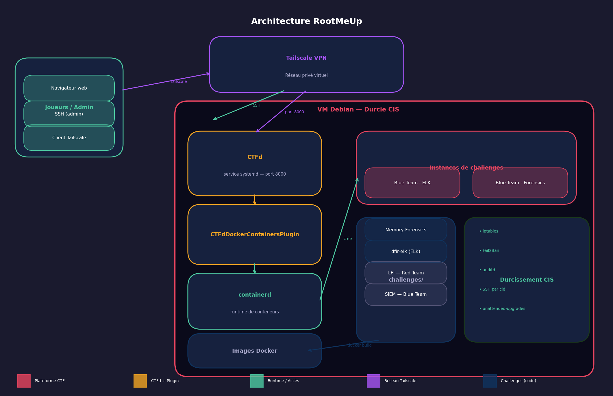

# RootMeUp

Plateforme CTF open-source pour étudiants et professionnels cybersécurité. Trois challenges progressifs Blue/Red Team, conteneurisés et sécurisés.

## 🎯 Objectif
- Challenges pratiques isolés par équipe (3 participants)
- Visualisation des scores et saisie des flags via l’interface CTFd
- Environnement pédagogique gratuit et francophone

## 🚧 Prérequis
- Docker, Docker-compose et Kubernetes installés
- Accès réseau aux ports exposés par CTFd (par défaut 8000) et aux challenges
- Optionnel : reverse proxy (Nginx/Traefik) pour le TLS et le rate limiting

## ⚙️ Installation
```bash
git clone <https://github.com/Jacob-dot-bit/RootMeUp>
cd RootMeUp
```
Préparez vos fichiers d’environnement (`.env`) pour CTFd et les challenges (secrets, flags, clés). Placez vos images de challenges dans un registry accessible ou construisez-les localement.

## 🧾 Configuration (.env)
Créer/ajuster ces fichiers avant le démarrage :
- `.env` (racine) : variables docker-compose (ports, tags d’images, options du reverse proxy si utilisé).
- `ctfd/.env` : secrets et paramètres CTFd.
- `challenges/<nom>/.env` : secrets/flags par challenge (ne pas les versionner).

Exemple minimal pour `ctfd/.env` :
```env
CTFD_SECRET_KEY=change-me
DATABASE_URL=postgresql://ctfd:ctfd@db/ctfd
REDIS_URL=redis://redis:6379/0
CTFD_LOG_LEVEL=INFO
ADMIN_EMAIL=admin@example.com
ADMIN_PASSWORD=change-me
```
Bonnes pratiques : gardez vos `.env` hors du dépôt git, fournissez un `.env.example` si besoin, et faites tourner régulièrement les secrets/flags.

## ▶️ Démarrage avec docker-compose (déploiement POC)
```bash
docker-compose up -d
```
Services attendus :
- `ctfd` (web + API)
- `db` (base de données CTFd)
- `challenge-*` (un conteneur par challenge)

## ☸️ Démarrage avec Kubernetes (déploiement PROD)

Kubernetes est utilisé pour **déployer dynamiquement des instances de challenges** à partir des images Docker correspondantes. Chaque équipe dispose de ses propres pods isolés, garantissant étanchéité, reproductibilité et montée en charge.

### Rôle de Kubernetes
- Orchestration des conteneurs de challenges
- Isolation par namespace (ex. : un namespace par équipe ou par session CTF)
- Déploiement à la demande (une instance = un pod ou un Deployment)
- Redémarrage automatique des challenges en cas de crash
- Scalabilité horizontale si plusieurs équipes lancent le même challenge

CTFd reste le point d’entrée central (web, scoring, flags) tandis que Kubernetes gère le cycle de vie des challenges.

### Objets Kubernetes utilisés
- **Namespace** : isolation logique par équipe ou par événement
- **Deployment** : déploiement des challenges (1 pod par instance)
- **Service** : exposition réseau interne ou externe des challenges
- **ConfigMap / Secret** : injection des variables d’environnement (flags, clés, configs)
- **Ingress** (optionnel) : exposition via un nom DNS et TLS

### Exemple de workflow
1. L’image Docker du challenge est construite et poussée dans un registry
2. Un manifest Kubernetes référence cette image
3. Lors du lancement du CTF (ou via un script/operator) :
   - Création du namespace
   - Déploiement des challenges requis
   - Exposition des services
4. Les participants accèdent aux challenges via les URLs fournies

### Exemple minimal de Deployment
```yaml
apiVersion: apps/v1
kind: Deployment
metadata:
  name: challenge-web-1
  labels:
    app: challenge-web-1
spec:
  replicas: 1
  selector:
    matchLabels:
      app: challenge-web-1
  template:
    metadata:
      labels:
        app: challenge-web-1
    spec:
      containers:
        - name: challenge
          image: registry.example.com/rootmeup/challenge-web:latest
          ports:
            - containerPort: 8080
          envFrom:
            - secretRef:
                name: challenge-web-secrets


## 🔗 Accès
- Interface CTFd : http://localhost:8000 (ou derrière votre proxy TLS)
- Soumission des flags : via l’UI CTFd
- Administration : compte admin défini dans les variables d’environnement CTFd

## 🧩 Challenges (aperçu)
- Challenge 1 : Blue Team — triage et analyse
- Challenge 2 : Red Team — exploitation contrôlée
- Challenge 3 : Purple — investigation + pivot

## 🏗️ Architecture

Détails : [docs/architecture.md](docs/architecture.md)

## 🔒 Bonnes pratiques opérationnelles
- Isoler chaque challenge sur un réseau dédié, exposer uniquement les ports nécessaires
- Stocker les flags côté serveur, les injecter au runtime, et les faire tourner régulièrement
- Activer les journaux d’accès CTFd et des conteneurs, surveiller la charge
- Sauvegarder la base CTFd et la configuration; tester la restauration

## 📄 Licence
Licence MIT (adaptée à un projet open source éducatif). Le fichier `LICENSE` contient le texte complet.