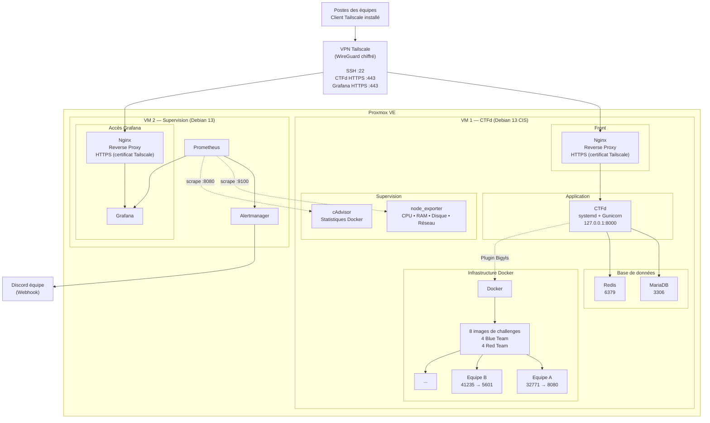
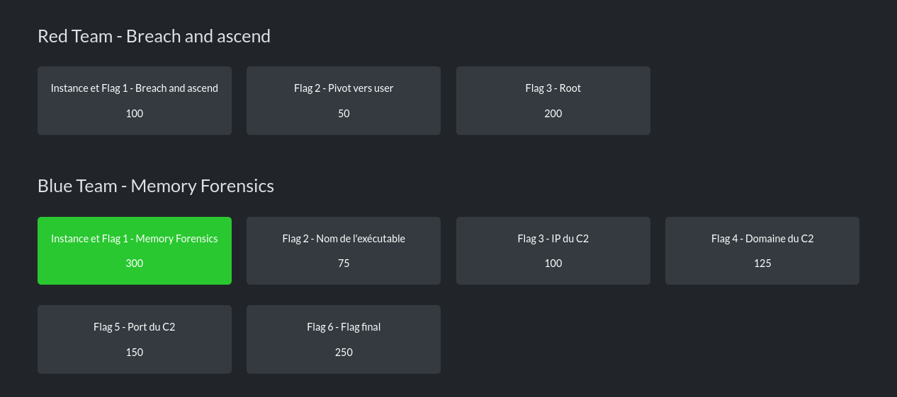
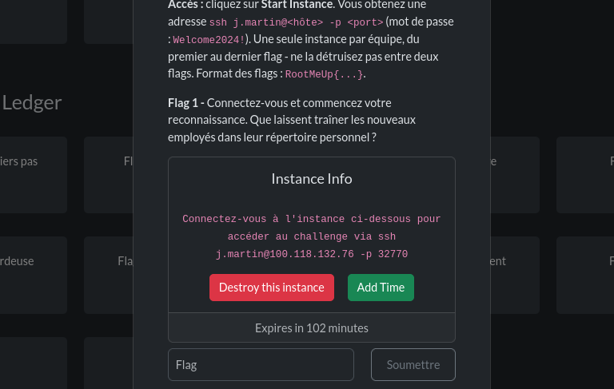
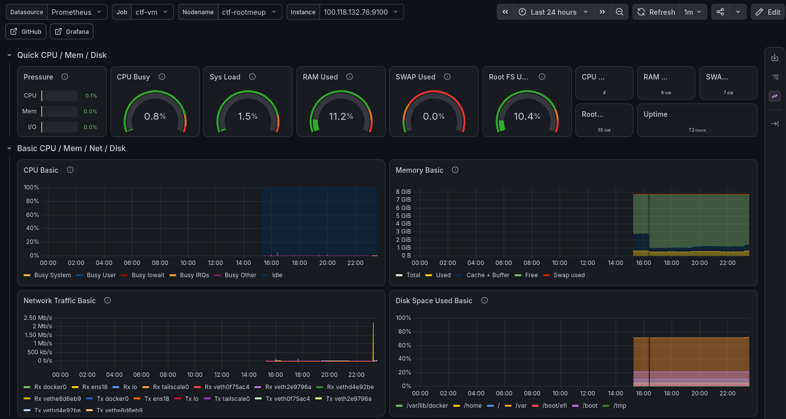

# RootMeUp

Plateforme CTF open-source pour étudiants et professionnels cybersécurité. Challenges progressifs Blue/Red Team, conteneurisés et isolés par équipe.

> **Projet Annuel — ESGI** · Mastère Sécurité Informatique · 4ᵉ année (M1) · 2025-2026
> Équipe de 4 étudiants. Ce dépôt est la **face technique** (jury/mainteneurs) ; le dépôt
> [**RootMeUp-CTF**](https://github.com/Jacob-dot-bit/RootMeUp-CTF) est destiné aux **joueurs**
> (guides uniquement, sans solutions ni flags).

## Sommaire
- [Contexte](#contexte)
- [Objectif](#objectif)
- [Architecture](#architecture)
- [Prérequis](#prérequis)
- [Accès à la plateforme](#accès-à-la-plateforme)
- [Lancement d'un challenge](#lancement-dun-challenge)
- [Challenges disponibles](#challenges-disponibles)
- [Ajout d'un challenge sur le serveur](#ajout-dun-challenge-sur-le-serveur)
- [Sécurité](#sécurité)
- [Durcissement du serveur](#durcissement-du-serveur)
- [Supervision](#supervision)
- [Documentation](#documentation)
- [Équipe projet](#équipe-projet)
- [Liens utiles](#liens-utiles)
- [Licence](#licence)

## Contexte

RootMeUp est une plateforme de *Capture The Flag* pédagogique développée dans le cadre
du Projet Annuel ESGI. Objectif : offrir un environnement d'entraînement cybersécurité
**Blue Team / Red Team**, gratuit et francophone, où chaque équipe dispose d'instances
de challenges **isolées**.

Le projet a connu deux phases :
- **T2** — première version hébergée sur une VM mutualisée de l'école. Ressources
  insuffisantes : le disque se remplissait et faisait **crasher CTFd**.
- **T3** — migration vers un **Proxmox dédié** (VM Debian durcie CIS), déploiement des
  challenges conteneurisés, puis mise en place d'une **supervision** (Grafana + Prometheus,
  alertes Discord) pour *anticiper* les incidents comme la saturation disque plutôt que
  de les subir.

## Objectif
- Challenges pratiques isolés par équipe (3 participants)
- Visualisation des scores et saisie des flags via l'interface CTFd
- Environnement pédagogique gratuit et francophone

## Architecture


```mermaid
flowchart TB

%% =====================
%% Clients
%% =====================

Users["Postes des équipes<br/>Client Tailscale installé"]

TS["VPN Tailscale<br/>(WireGuard chiffré)<br/><br/>SSH :22<br/>CTFd HTTPS :443<br/>Grafana HTTPS :443"]

Users --> TS

%% =====================
%% Hyperviseur
%% =====================

subgraph PROXMOX["Proxmox VE"]

%% ------------------------------------------------------------------
%% VM 1
%% ------------------------------------------------------------------

subgraph VM1["VM 1 — CTFd (Debian 13 CIS)"]

direction TB

subgraph FRONT["Front"]
NGINX["Nginx<br/>Reverse Proxy<br/>HTTPS (certificat Tailscale)"]
end

subgraph BACK["Application"]
CTFD["CTFd<br/>systemd + Gunicorn<br/>127.0.0.1:8000"]
end

subgraph DATA["Base de données"]
DB["MariaDB<br/>3306"]
REDIS["Redis<br/>6379"]
end

subgraph DOCKER["Infrastructure Docker"]
DOCKERD["Docker"]

CHALL["8 images de challenges<br/>4 Blue Team<br/>4 Red Team"]

A["Equipe A<br/>32771 → 8080"]
B["Equipe B<br/>41235 → 5601"]
C["..."]

DOCKERD --> CHALL
CHALL --> A
CHALL --> B
CHALL --> C

end

subgraph EXPORT["Supervision"]

NODE["node_exporter<br/>CPU • RAM • Disque • Réseau"]

CAD["cAdvisor<br/>Statistiques Docker"]

end

NGINX --> CTFD

CTFD --> DB
CTFD --> REDIS

CTFD -. Plugin Bigyls .-> DOCKERD

end

%% ------------------------------------------------------------------
%% VM2
%% ------------------------------------------------------------------

subgraph VM2["VM 2 — Supervision (Debian 13)"]

direction TB

subgraph GRAF["Accès Grafana"]

GRAFNG["Nginx<br/>Reverse Proxy<br/>HTTPS (certificat Tailscale)"]

GRAFANA["Grafana"]

end

PROM["Prometheus"]

ALERT["Alertmanager"]

GRAFNG --> GRAFANA

PROM --> GRAFANA

PROM --> ALERT

end

end

%% =====================
%% Réseau Tailscale
%% =====================

TS --> NGINX
TS --> GRAFNG

%% =====================
%% Supervision
%% =====================

PROM -. scrape :9100 .-> NODE

PROM -. scrape :8080 .-> CAD

%% =====================
%% Alertes
%% =====================

DISCORD["Discord équipe<br/>(Webhook)"]

ALERT --> DISCORD
```

Le serveur est une VM Debian durcie selon le benchmark CIS, qui héberge :
- **CTFd** : service systemd (gunicorn en local sur `127.0.0.1:8000`) ; **Apache** fait reverse-proxy et **termine le TLS sur `:443`** avec un **certificat Let's Encrypt** (obtenu via `tailscale cert` pour le nom MagicDNS) → `https://ctf-rootmeup.tail8588a8.ts.net/`
- **Docker** : utilisé pour construire et stocker les images des challenges
- **containerd** : runtime de conteneurs qui exécute effectivement les instances de challenges ; sert de lien entre CTFd et les conteneurs lancés
- **CTFdDockerContainersPlugin** : plugin CTFd qui déclenche via containerd la création d'une instance par équipe lors du lancement d'un challenge

L'accès à la plateforme se fait via **Tailscale** (réseau privé virtuel), ce qui évite d'exposer le serveur directement sur Internet.

## Prérequis

### Côté serveur
- Debian (durci CIS)
- Docker et containerd installés
- CTFd installé et configuré comme service systemd
- Plugin [CTFdDockerContainersPlugin](https://github.com/Bigyls/CTFdDockerContainersPlugin) installé dans CTFd
- Tailscale installé sur la VM

### Côté client
- Client Tailscale installé : https://tailscale.com/download
- Invitation au réseau Tailscale du projet (fournie par l'équipe)

## Accès à la plateforme

1. Installer Tailscale sur votre poste et se connecter
2. Rejoindre le réseau via le lien d'invitation fourni
3. Accéder à CTFd dans le navigateur (**HTTPS via Tailscale**) :

```
https://ctf-rootmeup.tail8588a8.ts.net/
```

5. Créer un compte, rejoindre ou créer une équipe (3 participants max)



> ℹ️ **Vous êtes joueur ?** Les guides pas-à-pas (sans solutions) sont dans le dépôt
> dédié [**RootMeUp-CTF**](https://github.com/Jacob-dot-bit/RootMeUp-CTF).

## Lancement d'un challenge

1. Ouvrir la liste des challenges dans CTFd
2. Sélectionner un challenge
3. Cliquer sur **Start Instance** — CTFdDockerContainersPlugin crée une instance Docker dédiée à votre équipe
4. Se connecter à l'instance via l'URL/port indiqués
5. Soumettre le flag dans l'interface CTFd



## Challenges disponibles

Numérotation par équipe (`N-Blue-Team-*` / `N-Red-Team-*`).

| # | Dossier | Nom | Catégorie | Statut |
|---|---------|-----|-----------|--------|
| Blue 1 | `challenges/1-Blue-Team-Phishing-ELK-Sarah` | Phishing sur corp.local — analyse de logs (ELK) | Blue Team | Intégré |
| Blue 2 | `challenges/2-Blue-Team-Memory-Forensics-Jakub` | Mémoire et analyse de malware (Volatility) | Blue Team | Intégré |
| Red 1 | `challenges/1-Red-Team-Binary-Vault-Jakub` | VAULT-9 — reverse + exploitation binaire (ret2win) | Red Team | Intégré |
| Red 2 | `challenges/2-Red-Team-Operation-Silent-Ledger-Lucas` | Opération Silent Ledger — machine Linux compromise (SSH → escalade → GPG) | Red Team | Intégré |
| Blue 3 | `challenges/3-Blue-Team-Hardening-Lucas` | Hardening / durcissement système | Blue Team | Intégré |
| Red 3 | `challenges/3-Red-Team-Nexus-Cipher-Sarah` | Cipher — pentest du portail API Nexus (crypto/web, 10 flags) | Red Team | Intégré |
| Red 4 | `challenges/4-Red-Team-breach-and-ascend` | Breach & Ascend — intrusion web (upload) puis élévation → root | Red Team | Intégré |
| Blue 4 | `challenges/4-Blue-Team-Helios-Incident` | Incident sur Helios corp - analyse capture réseau | Blue Team | Intégré |

## Ajout d'un challenge sur le serveur

> 📖 **Procédure complète de déploiement** (build, flags/rotation via `challenge.env`,
> câblage CTFd, convention de branches) : voir **[`docs/DEPLOIEMENT.md`](docs/DEPLOIEMENT.md)**.
>
> 🐞 **Bugs rencontrés & corrections** (retour d'expérience technique) :
> voir **[`docs/TROUBLESHOOTING.md`](docs/TROUBLESHOOTING.md)**.

Construire l'image Docker localement, l'exporter et la transférer sur le serveur :

```powershell
# Depuis PowerShell (Windows)
scp -i "<SSH_KEY_PATH>" ".\mon-challenge.tar" jakub@<IP_TAILSCALE_VM>:/tmp/
```

Sur le serveur, importer l'image :

```bash
docker load -i /tmp/mon-challenge.tar
docker images | grep mon-challenge
```

Puis créer le challenge dans CTFd (`Admin Panel > Challenges > Create Challenge > Type: container`) en renseignant l'image, le port et la commande de démarrage.

## Sécurité

Bonnes pratiques appliquées au dépôt et à la plateforme :

- **Séparation des publics** — les solutions/exploits restent dans ce dépôt technique ; les
  joueurs n'ont accès qu'au dépôt [RootMeUp-CTF](https://github.com/Jacob-dot-bit/RootMeUp-CTF)
  (guides sans réponses).
- **Isolation** — un conteneur par équipe et par challenge, réseau dédié.
- **Pas d'exposition Internet** — l'accès passe uniquement par **Tailscale**. **CTFd** et
  **Grafana** sont servis en **HTTPS** (certificats Let's Encrypt via Tailscale) : TLS terminé
  par **Apache** pour CTFd, par **`tailscale serve`** pour Grafana (cf. [`docs/SUPERVISION.md`](docs/SUPERVISION.md)).

## Durcissement du serveur

Mesures appliquées conformément au benchmark CIS Debian :
- Partitionnement clair des filesystem sur les serveurs
- Désactivation des modules et services inutiles
- Accès SSH par clé uniquement, connexion root interdite
- Pare-feu `iptables` filtrant les flux entrants/sortants
- Mises à jour automatiques (`unattended-upgrades`)
- Politique de mots de passe stricte pour les comptes locaux
- `auditd` configuré (changements de mots de passe, modifications de fichiers sensibles)
- `Fail2Ban` contre les tentatives de brute force

## Supervision

Le serveur CTFd est supervisé (métriques temps réel + alertes Discord) via une VM
Grafana + Prometheus dédiée. Détail : **[`docs/SUPERVISION.md`](docs/SUPERVISION.md)**.



## Documentation

| Document | Contenu |
|---|---|
| [`docs/architecture.md`](docs/architecture.md) | Architecture détaillée (composants, flux réseau, isolation) + schéma Mermaid |
| [`docs/tech-stack.md`](docs/tech-stack.md) | Pile technique et rôle de chaque brique |
| [`docs/security.md`](docs/security.md) | Mesures de sécurité et durcissement (CIS) |
| [`docs/DEPLOIEMENT.md`](docs/DEPLOIEMENT.md) | Déploiement d'un challenge (build, flags/rotation, câblage CTFd, branches) |
| [`docs/SUPERVISION.md`](docs/SUPERVISION.md) | Supervision (Grafana/Prometheus, alertes Discord, dead man's switch) |
| [`docs/TROUBLESHOOTING.md`](docs/TROUBLESHOOTING.md) | Bugs rencontrés & corrections (retour d'expérience) |

## Équipe projet

| Membre | Rôle |
|--------|------|
| Jakub | Chef de projet |
| Sarah | Architecte cybersécurité |
| Evan | Développeur de challenges |
| Lucas | Développeur de challenges et administrateur CTFd |

## Liens utiles

- Dépôt technique (ce dépôt) : https://github.com/Jacob-dot-bit/RootMeUp
- Dépôt joueurs (guides) : https://github.com/Jacob-dot-bit/RootMeUp-CTF
- Suivi des tâches (Trello) : https://trello.com/b/noVfLRlC/rootmeup

**Technologies utilisées :**
- CTFd : https://github.com/CTFd/CTFd
- Plugin CTFd (conteneurs) : https://github.com/Bigyls/CTFdDockerContainersPlugin
- Docker : https://www.docker.com/ · containerd : https://containerd.io/
- Tailscale : https://tailscale.com/
- Grafana : https://grafana.com/ · Prometheus : https://prometheus.io/
- Healthchecks.io (dead man's switch) : https://healthchecks.io/
- Benchmark CIS Debian : https://www.cisecurity.org/benchmark/debian_linux

## Licence

Licence MIT (projet open source éducatif). Voir le fichier `LICENSE`.
