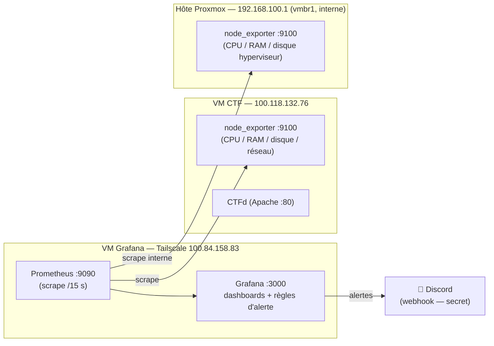

# Supervision — RootMeUp

Supervision de la santé du serveur CTFd (métriques temps réel) + **alerting** vers
Discord. Objectif : anticiper les incidents (le crash du T2 était dû à un **disque
plein**) plutôt que de les subir.

## Architecture



- **node_exporter** (sur la VM CTF **et** sur l'hôte Proxmox) : expose CPU / RAM / disque / réseau.
- **Prometheus** (VM Grafana) : collecte (scrape) les métriques toutes les 15 s — cibles `ctf-vm` et `proxmox-host`.
- **Grafana** (VM Grafana) : dashboards + moteur d'alerting.
- **Discord** : réception des alertes (webhook — **secret, non committé**, voir §Sécurité).

L'hôte Proxmox est scrapé **en interne** via son IP `vmbr1` (`192.168.100.1`) : node_exporter y
écoute **uniquement** sur cette IP, jamais sur l'IP publique `54.36.121.105`.

La VM Grafana est une VM Debian dédiée sur le Proxmox (`vmbr1`, Internet via NAT de
l'hôte, accès distant par Tailscale).

## Installation / reproduction

### 1. Agents de métriques (node_exporter)
**Sur la VM CTF :**
```bash
sudo apt install -y prometheus-node-exporter
sudo systemctl enable --now prometheus-node-exporter   # écoute sur :9100
```
**Sur l'hôte Proxmox** — même paquet, mais on **restreint l'écoute à l'IP interne**
`vmbr1` (sinon node_exporter serait exposé sur l'IP publique) :
```bash
apt install -y prometheus-node-exporter
echo 'ARGS="--web.listen-address=192.168.100.1:9100"' > /etc/default/prometheus-node-exporter
systemctl restart prometheus-node-exporter
ss -tlnp | grep 9100      # doit afficher 192.168.100.1:9100, PAS 0.0.0.0
```

### 2. Sur la VM Grafana — Grafana + Prometheus
```bash
# Grafana (dépôt officiel)
sudo apt install -y apt-transport-https software-properties-common wget
sudo mkdir -p /etc/apt/keyrings/
wget -qO- https://apt.grafana.com/gpg.key | sudo gpg --dearmor | sudo tee /etc/apt/keyrings/grafana.gpg >/dev/null
echo "deb [signed-by=/etc/apt/keyrings/grafana.gpg] https://apt.grafana.com stable main" | sudo tee /etc/apt/sources.list.d/grafana.list
sudo apt update && sudo apt install -y grafana prometheus
sudo systemctl enable --now grafana-server prometheus
```

### 3. Prometheus — scraper la VM CTF et l'hôte Proxmox
Ajouter dans `/etc/prometheus/prometheus.yml` :
```yaml
scrape_configs:
  - job_name: 'ctf-vm'
    static_configs:
      - targets: ['100.118.132.76:9100']
  - job_name: 'proxmox-host'
    static_configs:
      - targets: ['192.168.100.1:9100']   # hôte Proxmox via vmbr1 (interne)
        labels: { instance: 'proxmox' }
```
```bash
sudo systemctl restart prometheus
# vérifier la cible UP : http://<grafana>:9090/targets
```

### 4. Grafana — source de données + dashboard (provisionnés)
`/etc/grafana/provisioning/datasources/prometheus.yml` :
```yaml
apiVersion: 1
datasources:
  - name: Prometheus
    uid: prometheus
    type: prometheus
    access: proxy
    url: http://localhost:9090
    isDefault: true
```
Dashboard **« Node Exporter Full » (ID 1860)** provisionné dans
`/var/lib/grafana/dashboards/` (télécharger depuis `grafana.com/api/dashboards/1860`,
remplacer `${DS_PROMETHEUS}` par `prometheus`).

### 5. Alerting Discord
- **Point de contact** `Discord` + politique par défaut →
  `/etc/grafana/provisioning/alerting/discord.yaml` (contient le webhook — **jamais committé**).
- **Règles** (`/etc/grafana/provisioning/alerting/rules.yaml`), toutes routées vers Discord :

| Règle | Condition | Sévérité |
|---|---|---|
| Serveur CTFd injoignable | `up{job="ctf-vm"} == 0` pendant 1 min | critique |
| Disque presque plein (VM CTF) | filesystem `ext4/xfs` de la VM CTF > 85 % pendant 5 min | warning |
| RAM haute (VM CTF) | mémoire utilisée de la VM CTF > 90 % pendant 5 min | warning |
| Hôte Proxmox injoignable | `up{job="proxmox-host"} == 0` pendant 1 min | critique |
| Disque presque plein (Proxmox) | filesystem `ext4/xfs/zfs` de l'hyperviseur (dont `/var/lib/vz`) > 85 % pendant 5 min | critique |
| RAM haute (Proxmox) | mémoire utilisée de l'hyperviseur > 90 % pendant 5 min | warning |

## Accès

- **Grafana** : **`https://grafana.tail2f7520.ts.net`** (HTTPS via Tailscale, cert Let's Encrypt auto).
- **Prometheus** : `http://100.84.158.83:9090` (tailnet).
- Dashboard : *Dashboards → Node Exporter Full*, sélectionner le job `ctf-vm`.

### HTTPS via Tailscale (`tailscale serve`)
Grafana n'écoute qu'en local (`127.0.0.1:3000`) ; **Tailscale termine le TLS** sur `:443`
et proxifie vers Grafana. Le certificat Let's Encrypt est provisionné et renouvelé
automatiquement pour le nom MagicDNS. Prérequis : *HTTPS Certificates* activé dans la
console admin Tailscale (`login.tailscale.com/admin/dns`).

```bash
# sur la VM Grafana
tailscale serve --bg 3000          # https://<nom>.ts.net/ -> http://127.0.0.1:3000
tailscale serve status             # vérifier le mapping
# désactiver si besoin : tailscale serve --https=443 off
```
Côté Grafana (`/etc/grafana/grafana.ini`, section `[server]`) : `domain` et `root_url`
pointent sur `https://grafana.tail2f7520.ts.net/` pour que les liens générés soient corrects.

## Sécurité

- Le **webhook Discord** est un secret : il n'existe **que** dans
  `/etc/grafana/provisioning/alerting/discord.yaml` sur la VM Grafana, **jamais dans git**.
- Grafana/Prometheus ne sont pas exposés sur Internet (accès uniquement via Tailscale).
- **Grafana en HTTPS** (TLS terminé par Tailscale, cert Let's Encrypt) — plus de trafic en clair.
- Changer les identifiants Grafana par défaut (`admin`/`admin`).

## Évolutions possibles

- **Disponibilité HTTP** de CTFd (temps de réponse, code) → `prometheus-blackbox-exporter`.
- **Métriques des conteneurs** de challenges (RAM/CPU par instance) → `cAdvisor`.
- **Statistiques CTF** (équipes, résolutions, flags soumis) → source de données MySQL sur la base `ctfd`.
