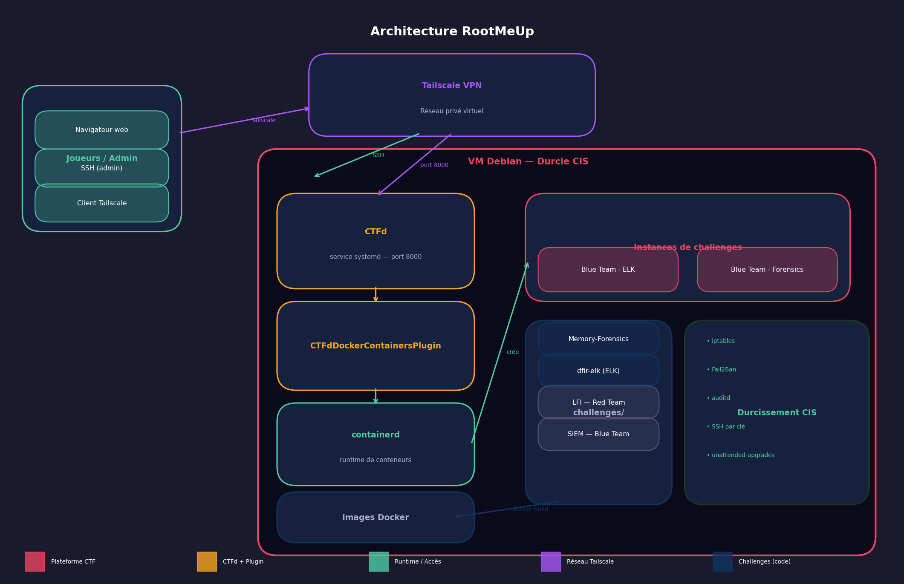

# Architecture RootMeUp

## Composants

- **CTFd** : interface web pour les joueurs, gestion des équipes, scores et flags. Géré comme un service systemd sur le port 8000.
- **containerd** : runtime de conteneurs, exécute les instances de challenges et fait le lien avec CTFd.
- **Docker** : utilisé pour construire et stocker les images des challenges.
- **CTFdDockerContainersPlugin** : plugin CTFd qui déclenche via containerd la création d'une instance isolée par équipe lors du lancement d'un challenge.
- **Tailscale** : réseau privé virtuel permettant l'accès sécurisé à la plateforme sans exposer le serveur sur Internet.

## Infrastructure

Une seule VM Debian, durcie selon le benchmark CIS, héberge l'ensemble des services :
- CTFd (systemd, port 8000)
- Docker + containerd
- Les images des challenges (chargées localement)

## Flux réseau

- **Joueurs → CTFd** (via Tailscale, port 8000) : authentification, consultation des challenges, soumission des flags.
- **CTFd → containerd** : le plugin crée une instance Docker par équipe à la demande.
- **Joueurs → instance du challenge** : connexion directe au port exposé par le conteneur.
- **Administrateurs → VM** : accès SSH par clé via Tailscale.

## Sécurité et isolation

- Un conteneur par équipe et par challenge, réseau dédié pour limiter les mouvements latéraux.
- Flags stockés côté serveur (CTFd) et injectés au runtime dans les conteneurs.
- Accès SSH par clé uniquement, connexion root interdite.
- Pare-feu `iptables`, `Fail2Ban`, `auditd`, `unattended-upgrades`.
- Accès à la plateforme restreint au réseau Tailscale.

## Exploitation

- Démarrage CTFd : `sudo systemctl start ctfd`
- Chargement d'une image : `docker load -i /tmp/image.tar`
- Vérification des conteneurs actifs : `docker ps`
- Vérification du port CTFd : `ss -tlnp | grep 8000`
