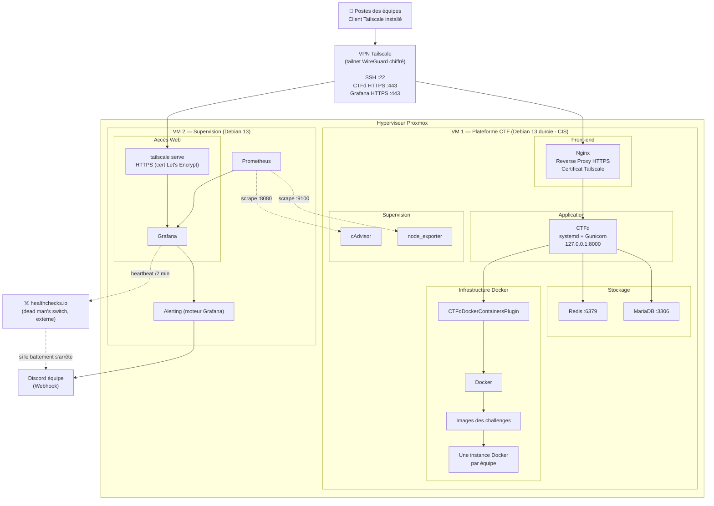

# Architecture RootMeUp


```mermaid
flowchart TB

%% =====================
%% Clients
%% =====================

Users["👤 Postes des équipes<br/>Client Tailscale installé"]

TS["VPN Tailscale<br/>(tailnet WireGuard chiffré)<br/><br/>SSH :22<br/>CTFd HTTPS :443<br/>Grafana HTTPS :443"]

Users --> TS

%% =====================
%% Hyperviseur
%% =====================

subgraph PROXMOX["Hyperviseur Proxmox"]

%% ------------------------------------------------------------------
%% VM1
%% ------------------------------------------------------------------

subgraph VM1["VM 1 — Plateforme CTF (Debian 13 durcie - CIS)"]

direction TB

subgraph FRONT["Front-end"]

NGINX["Nginx<br/>Reverse Proxy HTTPS<br/>Certificat Tailscale"]

end

subgraph APP["Application"]

CTFD["CTFd<br/>systemd + Gunicorn<br/>127.0.0.1:8000"]

end

subgraph DATA["Stockage"]

DB["MariaDB :3306"]

REDIS["Redis :6379"]

end

subgraph DOCKER["Infrastructure Docker"]

DOCKERD["Docker"]

PLUGIN["CTFdDockerContainersPlugin"]

IMAGES["Images des challenges"]

INST["Une instance Docker<br/>par équipe"]

end

subgraph EXPORT["Supervision"]

NODE["node_exporter"]

CAD["cAdvisor"]

end

NGINX --> CTFD

CTFD --> DB
CTFD --> REDIS

CTFD --> PLUGIN
PLUGIN --> DOCKERD
DOCKERD --> IMAGES
IMAGES --> INST

end

%% ------------------------------------------------------------------
%% VM2
%% ------------------------------------------------------------------

subgraph VM2["VM 2 — Supervision (Debian 13)"]

direction TB

subgraph WEB["Accès Web"]

GRAFNG["tailscale serve<br/>HTTPS (cert Let's Encrypt)"]

GRAF["Grafana"]

end

PROM["Prometheus"]

ALERT["Alerting (moteur Grafana)"]

GRAFNG --> GRAF

PROM --> GRAF

GRAF --> ALERT

end

end

TS --> NGINX
TS --> GRAFNG

PROM -. scrape :9100 .-> NODE
PROM -. scrape :8080 .-> CAD

DISCORD["Discord équipe<br/>(Webhook)"]

ALERT --> DISCORD

HC["☠️ healthchecks.io<br/>(dead man's switch, externe)"]

GRAF -. heartbeat /2 min .-> HC
HC -. si le battement s'arrête .-> DISCORD
```

---

# Plan d'adressage

Toutes les machines sont sur un **tailnet Tailscale unique** (`tail8588a8`) ; l'accès distant
se fait uniquement par ce VPN. Seul l'hôte Proxmox possède une IP publique (admin filtrée,
voir [`security.md`](security.md)).

| Machine | Rôle | Nom MagicDNS | IP tailnet | IP interne (`vmbr1`) |
|---|---|---|---|---|
| `ctf-rootmeup` | Plateforme CTFd + instances de challenges | `ctf-rootmeup.tail8588a8.ts.net` | `100.118.132.76` | 192.168.100.x |
| `grafana` | Supervision (Grafana + Prometheus) | `grafana.tail8588a8.ts.net` | `100.107.171.116` | `192.168.100.51` |
| `ns3092722` | Hyperviseur Proxmox | `ns3092722.tail8588a8.ts.net` | `100.98.246.62` | passerelle `192.168.100.1` |

- **IP publique** (hyperviseur uniquement) : `54.36.121.105` — admin (`22/8006/3128`) **filtrée**,
  accessible seulement via le tailnet.
- **Services HTTPS** : CTFd `https://ctf-rootmeup.tail8588a8.ts.net/` (TLS nginx),
  Grafana `https://grafana.tail8588a8.ts.net` (TLS `tailscale serve`).

---

# Composants

## VM 1 – Plateforme CTF

- **Nginx** : reverse proxy HTTPS accessible uniquement via le réseau Tailscale. Il termine le chiffrement TLS grâce aux certificats fournis par Tailscale puis relaie les requêtes vers Gunicorn.
- **CTFd** : plateforme de gestion du CTF. Le service est exécuté par **systemd** avec **Gunicorn** écoutant sur `127.0.0.1:8000`.
- **MariaDB** : base de données de CTFd (utilisateurs, équipes, scores, challenges, flags).
- **Redis** : cache utilisé par CTFd afin d'améliorer les performances.
- **Docker** : moteur de conteneurs exécutant les différentes instances de challenges.
- **CTFdDockerContainersPlugin** : plugin chargé de créer dynamiquement une instance Docker isolée pour chaque équipe lors du lancement d'un challenge.
- **node_exporter** : collecte les métriques système (CPU, mémoire, disque, réseau).
- **cAdvisor** : collecte les métriques des conteneurs Docker.

## VM 2 – Supervision

- **tailscale serve** : termine le TLS (HTTPS, cert Let's Encrypt) et proxifie vers Grafana — pas de reverse proxy nginx sur cette VM.
- **Prometheus** : collecte périodiquement les métriques exposées par les exporters de la VM CTF.
- **Grafana** : fournit les tableaux de bord de supervision et de suivi des performances.
- **Alerting Grafana** : le moteur d'alerting intégré à Grafana route les alertes vers Discord (pas d'Alertmanager séparé).

## Réseau privé

- **Tailscale** : réseau privé virtuel basé sur WireGuard assurant l'accès sécurisé aux deux machines virtuelles sans exposition directe sur Internet. Les certificats HTTPS sont générés automatiquement par Tailscale.

---

# Infrastructure

L'infrastructure est répartie sur deux machines virtuelles Debian 13 hébergées sur un hyperviseur **Proxmox**.

### VM 1 – Plateforme CTF

Elle héberge :

- Nginx
- CTFd
- MariaDB
- Redis
- Docker
- Les images et instances des challenges
- node_exporter
- cAdvisor

Cette machine est durcie conformément au benchmark **CIS Debian 13**.

### VM 2 – Supervision

Elle héberge :

- Grafana (+ moteur d'alerting intégré)
- Prometheus
- tailscale serve (HTTPS)

Cette VM supervise en permanence la VM CTF ainsi que ses conteneurs Docker.

---

# Flux réseau

## Joueurs → Plateforme CTF

Les joueurs rejoignent le **tailnet Tailscale** puis accèdent à l'interface CTFd en HTTPS.

```
Navigateur
      │
HTTPS
      ▼
Nginx
      ▼
Gunicorn
      ▼
CTFd
```

---

## CTFd → Docker

Lorsqu'une équipe démarre un challenge :

1. CTFd appelle le plugin Docker.
2. Le plugin crée un conteneur dédié.
3. Un port dynamique est attribué.
4. Les joueurs se connectent directement à cette instance.

---

## Supervision

Prometheus collecte régulièrement les métriques exposées par :

- node_exporter (`:9100`)
- cAdvisor (`:8080`)

Grafana interroge Prometheus pour afficher les tableaux de bord.

---

## Alertes

Le moteur d'alerting de **Grafana** évalue les règles et envoie les notifications vers des webhooks **Discord** (canaux distincts CTFd / Proxmox) lorsqu'un seuil critique est atteint (disque, mémoire, indisponibilité d'un service, etc.).

**Dead man's switch (détection de la panne totale).** Grafana/Prometheus étant hébergés sur le Proxmox, une panne **totale** de l'hyperviseur tuerait aussi la supervision — qui ne pourrait donc pas alerter. Parade : la VM de supervision envoie un **battement** régulier (toutes les 2 min) à **[healthchecks.io](https://healthchecks.io)** (service externe) ; si les battements s'arrêtent, healthchecks.io déclenche une alerte **Discord + email**. Détails : [`SUPERVISION.md`](SUPERVISION.md) §6.

---

# Sécurité et isolation

- Deux machines virtuelles distinctes : plateforme CTF et supervision.
- Durcissement CIS Debian 13 sur les deux VM.
- Une instance Docker isolée par équipe.
- Réseau privé Tailscale obligatoire.
- HTTPS assuré par les certificats Tailscale.
- Authentification SSH par clé uniquement.
- Connexion root désactivée.
- Pare-feu `iptables`.
- `Fail2Ban`.
- `auditd`.
- `unattended-upgrades`.
- Supervision continue de la plateforme via Prometheus et Grafana.

---

# Exploitation

## Plateforme CTF

Démarrer CTFd :

```bash
sudo systemctl start ctfd
```

Vérifier le service :

```bash
sudo systemctl status ctfd
```

Lister les conteneurs :

```bash
docker ps
```

Vérifier Gunicorn :

```bash
ss -tlnp | grep 8000
```

Vérifier Nginx :

```bash
sudo systemctl status nginx
```

---

## Supervision

Vérifier Prometheus :

```bash
sudo systemctl status prometheus
```

Vérifier Grafana :

```bash
sudo systemctl status grafana-server
```

Vérifier le mapping HTTPS (tailscale serve) :

```bash
tailscale serve status
```